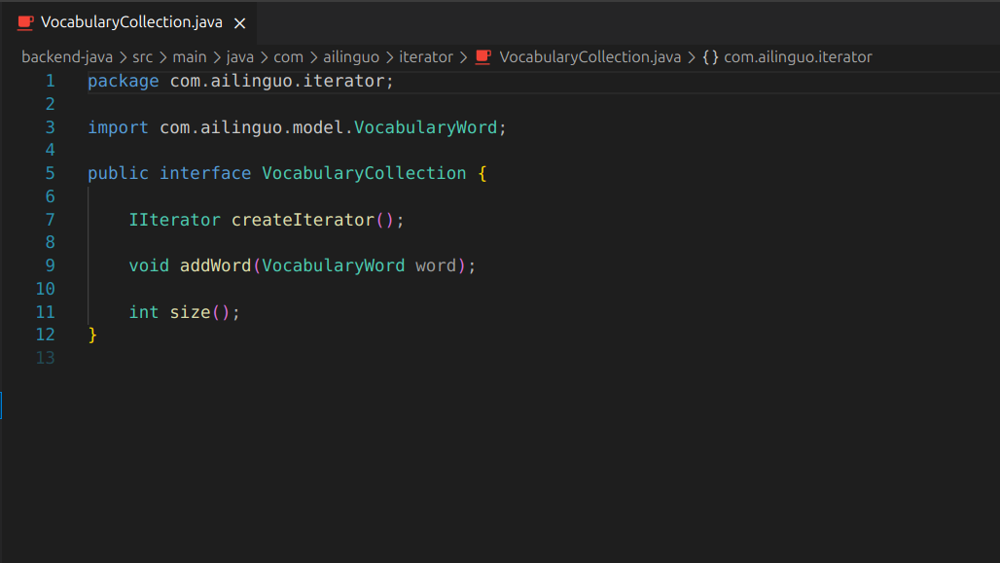

# Padrão Comportamental Iterator - VocabularyWord

## Sumário

- [Introdução](#Introdução)
- [Objetivo](#Objetivo)
- [Metodologia](#Metodologia)
- [Desenvolvimento e Implementação](#Desenvolvimento-e-Implementação)
- [Modelagem do Iterator para VocabularyWord](#Modelagem-do-Iterator-para-VocabularyWord)
    - [Implementação das Classes do Iterator](#Implementação-das-Classes-do-Iterator)
    - [Classe de Teste VocabularyIteratorTest](#Classe-de-Teste-VocabularyIteratorTest)
- [Vídeo Explicação e Execução do Iterator para VocabularyWord](#Vídeo-Explicação-e-Execução-do-Iterator-para-VocabularyWord)
- [Discussão Vantagens e Desvantagens do Iterator](#Discussão-Vantagens-e-Desvantagens-do-Iterator)
- [Conclusão](#Conclusão)
- [Referências](#Referências)
- [Histórico de Versão](#Histórico-de-Versão)

## Introdução

Como explicado em [Iterator](https://refactoring.guru/pt-br/design-patterns/iterator), o padrão de projeto Iterator é uma solução comportamental utilizada para fornecer uma maneira de acessar sequencialmente elementos de um agregado sem expor sua representação subjacente. Com isso, ele oferece uma interface uniforme para percorrer diferentes tipos de coleções, o que o torna especialmente útil para gerenciar coleções de dados complexas, como listas de vocabulário, sem acoplar o código cliente à estrutura interna da coleção.

No contexto do projeto AILinguo, o padrão Iterator foi aplicado à classe VocabularyWord, responsável por centralizar o acesso sequencial às palavras de vocabulário, permitindo iteração por categoria, nível CEFR e outras características. Assim, essa decisão arquitetural foi tomada para assegurar que haja uma interface consistente para percorrer coleções de vocabulário no sistema e evitar acoplamento entre o código cliente e a estrutura interna das coleções.

## Objetivo

Os principais objetivos ao aplicar o padrão Iterator à classe VocabularyWord são:

* *Interface Uniforme:* Fornecer uma maneira consistente de acessar elementos de coleções de vocabulário, independentemente da estrutura interna.
* *Encapsulamento:* Esconder a implementação interna da coleção, permitindo que o código cliente acesse os elementos sem conhecer detalhes de implementação.
* *Múltiplos Iteradores:* Permitir que vários iteradores percorram a mesma coleção simultaneamente sem interferência.
* *Flexibilidade:* Facilitar a adição de novos tipos de iteração sem modificar o código existente.

## Metodologia

O padrão de projeto comportamental *Iterator* foi selecionado para a classe VocabularyWord devido à necessidade de fornecer acesso sequencial e controlado às coleções de vocabulário. Assim, como foi descrito em [Padrão Iterator: Implementação e Exemplos de Uso](https://refactoring.guru/pt-br/design-patterns/iterator), esta abordagem garante uma interface uniforme para percorrer coleções.

A implementação do padrão Iterator para a classe VocabularyWord foi realizada em Java, utilizando o Spring Boot como framework de desenvolvimento, com o apoio das ferramentas e extensões para desenvolvimento Java. O processo de desenvolvimento seguiu as práticas padrão de codificação e organização em pacotes, conforme detalhado nas seções subsequentes.

A concepção das classes do Iterator foi guiada pela análise dos seguintes artefatos de modelagem previamente desenvolvidos:

* *Análise de Coleções de Vocabulário:* As classes do Iterator são fundamentais para o acesso sequencial às palavras de vocabulário na aplicação AILinguo, sendo utilizadas por controladores, serviços e componentes do sistema.
* *Gerenciamento de Iteração:* As classes mantêm controle sobre a posição atual da iteração e fornecem métodos para navegar pela coleção.
* *Encapsulamento de Estrutura:* Múltiplas partes do sistema precisam acessar palavras de vocabulário de forma consistente, incluindo iteração por categoria, nível CEFR e outras características.

*O desenvolvimento e implementação das classes do Iterator seguiram os seguintes passos:*

1.  *Identificação da Necessidade de Iteração:* Foi constatado, a partir da análise dos requisitos de acesso a coleções de vocabulário, que a plataforma "AILinguo" deveria possuir uma interface uniforme para percorrer palavras de vocabulário. Esta interface centraliza todas as operações de iteração, e a existência de múltiplas implementações seria conceitualmente incorreta e logisticamente problemática.
2.  *Escolha do Padrão Iterator:* Diante da exigência de uma interface uniforme para percorrer coleções, o padrão de projeto comportamental Iterator foi escolhido como a solução de design mais direta e apropriada.
3.  *Definição da Estrutura das Classes:* Criação dos arquivos IIterator.java, VocabularyCollection.java, VocabularyWordCollection.java e VocabularyWordIterator.java.
4.  *Implementação dos Elementos Característicos do Iterator*
5.  *Definição dos Métodos de Negócio da Iteração*
6.  *Integração e Teste na Aplicação (VocabularyIteratorTest.java):*

*Principais Componentes e Características da Implementação do Iterator:*

* *Interface IIterator:* Define os métodos básicos para iteração (hasNext() e next()).
* *Interface VocabularyCollection:* Define a interface para criar iteradores e gerenciar a coleção.
* *Classe VocabularyWordCollection:* Implementa a interface VocabularyCollection e gerencia a coleção de palavras.
* *Classe VocabularyWordIterator:* Implementa a interface IIterator e fornece a lógica de iteração sobre a coleção.

No contexto do "AILinguo", as classes do Iterator devem encapsular suas funcionalidades (como iteração sequencial, controle de posição e acesso aos elementos) e a lógica para gerenciá-los, enquanto o padrão Iterator controla o acesso e a navegação.

## Desenvolvimento e Implementação

A seguir, são detalhadas a modelagem e a implementação das classes do Iterator e sua interação com outras partes do sistema.

## Modelagem do Iterator para VocabularyWord

Abaixo o espaço para o seu diagrama UML para o Iterator do VocabularyWord:

    Figura 1 (Iterator): Modelagem UML do Padrão Iterator para VocabularyWord
     
    
     
    <b>Autores:</b> Gabriel, Leonardo de Melo, Mateus Bastos, Vitor Bessa, Felipe das Neves.
     

---
## Vídeo explicação do diagrama UML Iterator

    Vídeo 1
     
    <iframe width="1321" height="743" src="https://www.youtube.com/embed/iCIbbvTkn2o" title="Vídeo 3" frameborder="0" allow="accelerometer; autoplay; clipboard-write; encrypted-media; gyroscope; picture-in-picture; web-share" referrerpolicy="strict-origin-when-cross-origin" allowfullscreen></iframe>
     
    <b>Autor:</b> Mateus Bastos.
     

---

## Implementação das Classes do Iterator

As classes do Iterator foram implementadas no pacote com.ailinguo.iterator para representar o sistema de iteração de vocabulário da plataforma. Elas contêm interfaces bem definidas para iteração, implementações concretas para gerenciar coleções e iteradores, e métodos para operações de iteração.

Abaixo o código para as classes do Iterator:

  
<strong>Código para IIterator.java:</strong>

    java package com.ailinguo.iterator;

    public interface IIterator {
    
         public boolean hasNext();

         public Object next();
    }

<b> Autores: </b> Gabriel, Leonardo de Melo, Mateus Bastos, Vitor Bessa, Felipe das Neves.

  
<strong>Código para VocabularyCollection.java:</strong>

    java
    package com.ailinguo.iterator;

    import com.ailinguo.model.VocabularyWord;

    public interface VocabularyCollection {
        IIterator createIterator();
        void addWord(VocabularyWord word);
        int size();
    }

<b> Autores: </b> Gabriel, Leonardo de Melo, Mateus, Vitor, Felipe.

  
<strong>Código para VocabularyWordCollection.java:</strong>

    java
    package com.ailinguo.iterator;

    import com.ailinguo.model.VocabularyWord;
    import java.util.ArrayList;
    import java.util.List;

    public class VocabularyWordCollection implements VocabularyCollection {
    
        private final List<VocabularyWord> words;
    
        public VocabularyWordCollection() {
            this.words = new ArrayList<>();
        }
    
        public VocabularyWordCollection(List<VocabularyWord> words) {
            this.words = new ArrayList<>(words);
        }
    
        @Override
             public IIterator createIterator() {
            return new VocabularyWordIterator(words);
        }
    
         @Override
            public void addWord(VocabularyWord word) {
            words.add(word);
        }
    
        @Override
            public int size() {
            return words.size();
        }
    
        public List<VocabularyWord> getWords() {
            return new ArrayList<>(words);
            }
        }

<b> Autores: </b> Gabriel, Leonardo de Melo, Mateus, Vitor, Felipe.

  
<strong>Código para VocabularyWordIterator.java:</strong>

    java
    package com.ailinguo.iterator;

    import com.ailinguo.model.VocabularyWord;
    import java.util.List;
    import java.util.NoSuchElementException;

    public class VocabularyWordIterator implements IIterator {
    
        private final List<VocabularyWord> words;
        private int currentPosition;
    
        public VocabularyWordIterator(List<VocabularyWord> words) {
            this.words = words;
            this.currentPosition = 0;
        }
    
    @Override
    public boolean hasNext() {
        return currentPosition < words.size();
    }
    
    @Override
    public Object next() {
        if (!hasNext()) {
            throw new NoSuchElementException("Não há mais palavras na coleção");
        }
        return words.get(currentPosition++);
        }
    }

<b> Autores: </b> Gabriel, Leonardo de Melo, Mateus, Vitor, Felipe.

##### Imagem do código no VSCODE

As figuras 2, 3, 4 e 5 abaixo ilustram a estrutura das classes do Iterator no ambiente de desenvolvimento VSCode.

    Figura 2: Interface IIterator.java
     
    
     
    <b>Autores:</b> Gabriel, Leonardo de Melo, Mateus Bastos, Vitor Bessa, Felipe das Neves.
     

    Figura 3: Interface VocabularyCollection.java
     
    
     
    <b>Autores:</b> Gabriel, Leonardo de Melo, Mateus, Vitor, Felipe.
     

    Figura 4: Classe VocabularyWordCollection.java
     
    
     
    <b>Autores:</b> Gabriel, Leonardo de Melo, Mateus, Vitor, Felipe.
     

    Figura 5: Classe VocabularyWordIterator.java
     
    
     
    <b>Autores:</b> Gabriel, Leonardo de Melo, Mateus, Vitor, Felipe.
     

## Classe de Teste VocabularyIteratorTest

A classe VocabularyIteratorTest.java foi criada para demonstrar e testar o funcionamento do padrão Iterator aplicado ao VocabularyWord. Esta classe contém testes que verificam a funcionalidade de iteração, encapsulamento da estrutura interna e múltiplos iteradores.

*Observação:* Embora a implementação completa de testes unitários não seja o foco deste documento sobre Iterator, sua existência é necessária para a validação da funcionalidade das classes do Iterator.

Abaixo o código para VocabularyIteratorTest.java:

  
<strong>Código para VocabularyIteratorTest.java</strong>

java
package com.ailinguo.iterator;

import com.ailinguo.model.VocabularyWord;
import org.junit.jupiter.api.Test;
import org.springframework.boot.test.context.SpringBootTest;

import java.util.ArrayList;
import java.util.List;

import static org.junit.jupiter.api.Assertions.*;

@SpringBootTest
public class VocabularyIteratorTest {

    @Test
    public void testIteratorPattern() {
        System.out.println("\n=== TESTANDO PADRÃO ITERATOR PARA VOCABULARY WORD ===");
        
        // Criar lista de palavras de teste
        List<VocabularyWord> testWords = createTestWords();
        
        // Criar coleção usando o padrão Iterator
        VocabularyWordCollection collection = new VocabularyWordCollection(testWords);
        
        // Criar iterator
        IIterator iterator = collection.createIterator();
        
        // Testar iteração
        List<VocabularyWord> iteratedWords = new ArrayList<>();
        int position = 1;
        
        while (iterator.hasNext()) {
            VocabularyWord word = (VocabularyWord) iterator.next();
            iteratedWords.add(word);
            System.out.println("Posição " + position++ + ": " + word.getEnglishWord() + " - " + word.getPortugueseTranslation());
        }
        
        // Verificações
        assertEquals(testWords.size(), iteratedWords.size(), "Todas as palavras devem ser iteradas");
        assertEquals(testWords.get(0).getEnglishWord(), iteratedWords.get(0).getEnglishWord(), "Primeira palavra deve ser igual");
        assertEquals(testWords.get(testWords.size()-1).getEnglishWord(), iteratedWords.get(iteratedWords.size()-1).getEnglishWord(), "Última palavra deve ser igual");
        
        System.out.println("✅ Padrão Iterator funcionando corretamente!");
        System.out.println("Total de palavras iteradas: " + iteratedWords.size());
        System.out.println("===============================================\n");
    }
    
    @Test
    public void testMultipleIterators() {
        System.out.println("=== TESTANDO MÚLTIPLOS ITERADORES ===");
        
        List<VocabularyWord> testWords = createTestWords();
        VocabularyWordCollection collection = new VocabularyWordCollection(testWords);
        
        // Criar dois iteradores independentes
        IIterator iterator1 = collection.createIterator();
        IIterator iterator2 = collection.createIterator();
        
        // Iterar com o primeiro iterator
        List<VocabularyWord> words1 = new ArrayList<>();
        while (iterator1.hasNext()) {
            words1.add((VocabularyWord) iterator1.next());
        }
        
        // Iterar com o segundo iterator
        List<VocabularyWord> words2 = new ArrayList<>();
        while (iterator2.hasNext()) {
            words2.add((VocabularyWord) iterator2.next());
        }
        
        // Verificar que ambos iteraram todas as palavras
        assertEquals(testWords.size(), words1.size(), "Primeiro iterator deve iterar todas as palavras");
        assertEquals(testWords.size(), words2.size(), "Segundo iterator deve iterar todas as palavras");
        assertEquals(words1.size(), words2.size(), "Ambos iteradores devem ter o mesmo número de palavras");
        
        System.out.println("✅ Múltiplos iteradores funcionando corretamente!");
        System.out.println("Iterator 1: " + words1.size() + " palavras");
        System.out.println("Iterator 2: " + words2.size() + " palavras");
        System.out.println("===============================================\n");
    }
    
    @Test
    public void testEmptyCollection() {
        System.out.println("=== TESTANDO COLEÇÃO VAZIA ===");
        
        VocabularyWordCollection emptyCollection = new VocabularyWordCollection();
        IIterator iterator = emptyCollection.createIterator();
        
        assertFalse(iterator.hasNext(), "Iterator de coleção vazia não deve ter próximo elemento");
        
        try {
            iterator.next();
            fail("Deve lançar exceção ao tentar acessar próximo elemento de coleção vazia");
        } catch (NoSuchElementException e) {
            System.out.println("✅ Exceção lançada corretamente: " + e.getMessage());
        }
        
        System.out.println("===============================================\n");
    }
    
    @Test
    public void testCollectionOperations() {
        System.out.println("=== TESTANDO OPERAÇÕES DA COLEÇÃO ===");
        
        VocabularyWordCollection collection = new VocabularyWordCollection();
        
        // Testar adição de palavras
        VocabularyWord word1 = createVocabularyWord(1L, "Hello", "Olá", "A1", 10);
        VocabularyWord word2 = createVocabularyWord(2L, "World", "Mundo", "A1", 10);
        
        collection.addWord(word1);
        collection.addWord(word2);
        
        assertEquals(2, collection.size(), "Coleção deve ter 2 palavras");
        
        // Testar iteração após adição
        IIterator iterator = collection.createIterator();
        List<VocabularyWord> words = new ArrayList<>();
        while (iterator.hasNext()) {
            words.add((VocabularyWord) iterator.next());
        }
        
        assertEquals(2, words.size(), "Deve iterar 2 palavras");
        assertTrue(words.contains(word1), "Deve conter a primeira palavra");
        assertTrue(words.contains(word2), "Deve conter a segunda palavra");
        
        System.out.println("✅ Operações da coleção funcionando corretamente!");
        System.out.println("Tamanho da coleção: " + collection.size());
        System.out.println("===============================================\n");
    }
    
    private List<VocabularyWord> createTestWords() {
        List<VocabularyWord> words = new ArrayList<>();
        words.add(createVocabularyWord(1L, "Hello", "Olá", "A1", 10));
        words.add(createVocabularyWord(2L, "World", "Mundo", "A1", 10));
        words.add(createVocabularyWord(3L, "Good", "Bom", "A1", 10));
        words.add(createVocabularyWord(4L, "Morning", "Manhã", "A1", 10));
        words.add(createVocabularyWord(5L, "Evening", "Noite", "A1", 10));
        return words;
    }
    
    private VocabularyWord createVocabularyWord(Long id, String english, String portuguese, String cefrLevel, Integer xpReward) {
        VocabularyWord word = new VocabularyWord();
        word.setId(id);
        word.setEnglishWord(english);
        word.setPortugueseTranslation(portuguese);
        word.setCefrLevel(cefrLevel);
        word.setXpReward(xpReward);
        return word;
    }
}

<b> Autores: </b> Gabriel, Leonardo de Melo, Mateus, Vitor, Felipe.
##### Imagem do código no VSCODE

As figuras 7 e 8 ilustram a estrutura da classe VocabularyIteratorTest.java no ambiente de desenvolvimento VSCode.

    Figura 7: Classe de Teste VocabularyIteratorTest.java (Parte 1)
     
    
     
    <b>Autores:</b> Gabriel, Leonardo de Melo, Mateus, Vitor, Felipe.
     

---

    Figura 8: Classe de Teste VocabularyIteratorTest.java (Parte 2/Continuação)
     
    
     
    <b>Autores:</b> Gabriel, Leonardo de Melo, Mateus, Vitor, Felipe.
     

## Vídeo Explicação e Execução do Iterator para VocabularyWord

O vídeo 2 abaixo mostra explicação e a execução do Iterator para VocabularyWord

    Vídeo 2: Iterator para VocabularyWord
     
    <iframe width="1321" height="743" src="https://www.youtube.com/embed/vim6iAUT1Rw?si=-pIlRTh9z-lVbvDK" title="AILinguo: Explicação e Execução do Iterator para VocabularyWord" frameborder="0" allow="accelerometer; autoplay; clipboard-write; encrypted-media; gyroscope; picture-in-picture; web-share" referrerpolicy="strict-origin-when-cross-origin" allowfullscreen></iframe>
    
    <b>Autores:</b> Leonardo de Melo e Vitor.
     

## Discussão Vantagens e Desvantagens do Iterator

A escolha de utilizar o padrão Iterator para as classes de vocabulário foi ponderada, considerando seus benefícios e também as críticas frequentemente associadas a este padrão.

*Vantagens Observadas:*

- *Interface Uniforme:* O padrão fornece uma interface consistente para percorrer diferentes tipos de coleções, independentemente da estrutura interna.
- *Encapsulamento:* A implementação interna da coleção fica oculta do código cliente, permitindo mudanças na estrutura sem afetar o código que a utiliza.
- *Múltiplos Iteradores:* Permite que vários iteradores percorram a mesma coleção simultaneamente sem interferência.
- *Flexibilidade:* Facilita a adição de novos tipos de iteração sem modificar o código existente.

*Desvantagens e Considerações (Críticas ao Iterator):*

É importante reconhecer as críticas comuns ao padrão Iterator, que foram consideradas:

- *Complexidade Adicional:* O padrão pode adicionar complexidade desnecessária para coleções simples.
- *Performance:* Pode haver overhead adicional devido às chamadas de método e controle de estado.
- *Overhead de Memória:* Cada iterator mantém seu próprio estado, o que pode consumir memória adicional.
- *Limitações de Funcionalidade:* Alguns tipos de iteração avançada podem não ser suportados pela interface básica.

*Observação:* No contexto deste projeto e para as coleções de vocabulário que requerem iteração flexível e múltiplos acessos simultâneos, os benefícios de encapsulamento e interface uniforme foram considerados preponderantes.

## Conclusão

A implementação das classes do Iterator utilizando o padrão Iterator atendeu ao requisito de fornecer uma interface uniforme para percorrer coleções de vocabulário e encapsular a estrutura interna das coleções. A aplicação do padrão Iterator nas classes de vocabulário demonstra como este padrão pode ser efetivamente utilizado para gerenciar acesso sequencial a coleções em aplicações Spring Boot, garantindo flexibilidade e encapsulamento sobre operações de iteração.

## Bibliogaria

> FREEMAN, Eric et al. Use A Cabeça Padrões e Projetos. Rio de Janeiro: Alta Books, 2007.

> GAMMA, E. et al. Padrões de projeto: soluções reutilizáveis de software orientado a objetos. Porto Alegre: Bookman, 2006.

> Refactoring.Guru – Iterator: https://refactoring.guru/pt-br/design-patterns/iterator

## Histórico de versão

| Versão | Descrição | Autor(es) | Data de Produção | Revisor(es) | Data de Revisão | Incremento do Revisor |
| :----: | --------- | --------- | :--------------: | ----------- | :-------------: | :-------------------: |
| `1.0` | Elaboração dos códigos | [Leonardo de Melo](https://github.com/leozinlima) e [Vitor Bessa](Bessazs) | 22/10/2025 | | | |
| `1.1` | Elaboração da documentação | [Gabriel Lima](https://github.com/gabriel-lima258), [Mateus Bastos](https://github.com/MateuSansete), [Leonardo de Melo](https://github.com/leozinlima), [Vitor Bessa](Bessazs)  | 22/10/2025 | | | |
| `1.2` | Ajuste imagens dos códigos UML | [Mateus Bastos](https://github.com/MateuSansete) e [Felipe das Neves](https://github.com/FelipeFreire-gf) | 22/10/2025 | | | |
| `1.3` | Adição do vídeo de explicação e execução | [Vítor Bessa](Bessazs) | 22/10/2025 | | | |
| `1.4` | Corrigindo link quedrados | [Letícia Monteiro](https://github.com/LeticiaMonteiroo)  | 22/10/2025 | | | |
