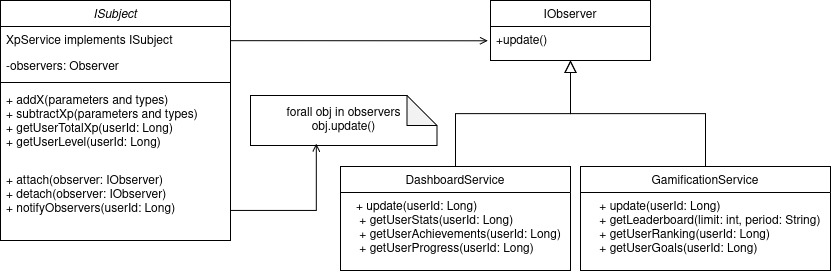

# Observer

---
## Sumário
- [Introdução](#introdução)
- [Diagrama UML](#diagrama)
- [Referências Bibliográficas](#referencias-bibliográficas)
- [Histórico de Versões](#histórico-de-versões)

---

## Introdução

Segundo Eric Freeman, no livro __"Use a Cabeça! Padrões E Projetos"__, o padrão __Observer__ é apresentado como um modo de definir uma dependência de um-para-muitos entre objetos. 
Dessa forma, quando um objeto (o "subject" ou "observado") muda seu estado, todos os seus dependentes (os "observers" ou "observadores") são notificados e atualizados automaticamente.

Um exemplo prático para esse contexto seria um sistema de gamificação: quando um **Aluno** (o "subject") finaliza atividades, seu objeto de pontuação é atualizado. Esse objeto, por sua vez, notifica automaticamente todos os "observers" que se registraram para "ouvir" suas mudanças, como um **Dashboard** ou um **Sistema de Ranking**, que então se atualizam para exibir a nova pontuação.

Isso promove um baixo acoplamento, pois o "subject" (Aluno/Pontuação) não precisa conhecer os detalhes concretos dos seus "observers" (como o Dashboard funciona), apenas que eles implementam uma interface comum para receber a notificação.

---

## Diagrama UML

[Letícia Monteiro](https://github.com/LeticiaMonteiroo)
---

## Bibliogaria

> FREEMAN, Eric et al. Use A Cabeça Padrões e Projetos. Rio de Janeiro: Alta Books, 2007.

> GAMMA, E. et al. Padrões de projeto: soluções reutilizáveis de software orientado a objetos. Porto Alegre: Bookman, 2006.

---

## Histórico de Versões

| Versão | Descrição | Autor(es) | Data de Produção | Revisor(es) | Data de Revisão | Incremento do Revisor |
| :----: | --------- | --------- | :--------------: | ----------- | :-------------: | :-------------------: |
| `1.0` | Documentação e formatação da aba.  | [Samuel Afonso](https://github.com/SamuelAfonso) | 23/10/2025 | | | |
| `1.1` | Criação do documento para o padrão Observer e adição de exemplo prático. | [Emivalto Da Costa Tavares Junior](https://github.com/EmivaltoJrr) | 23/10/2025 | | | |
| `1.2` | Adição da UML do Observer | [Letícia Monteiro](https://github.com/LeticiaMonteiroo)  | 23/10/2025 | | | |