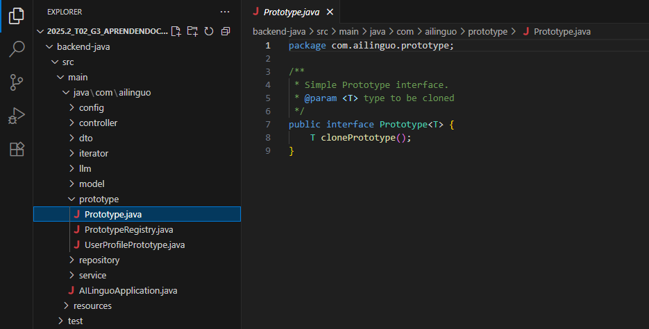
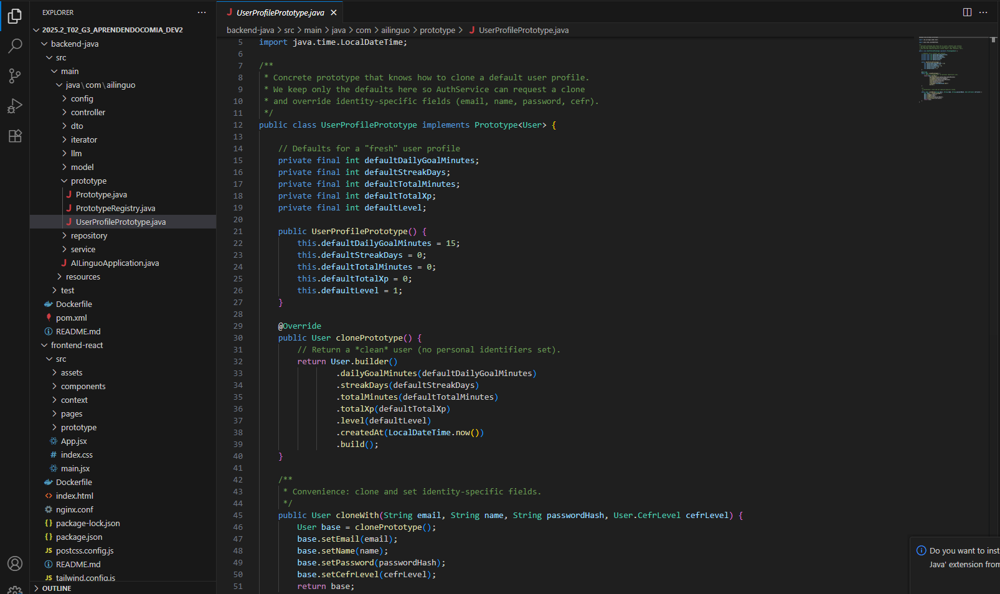
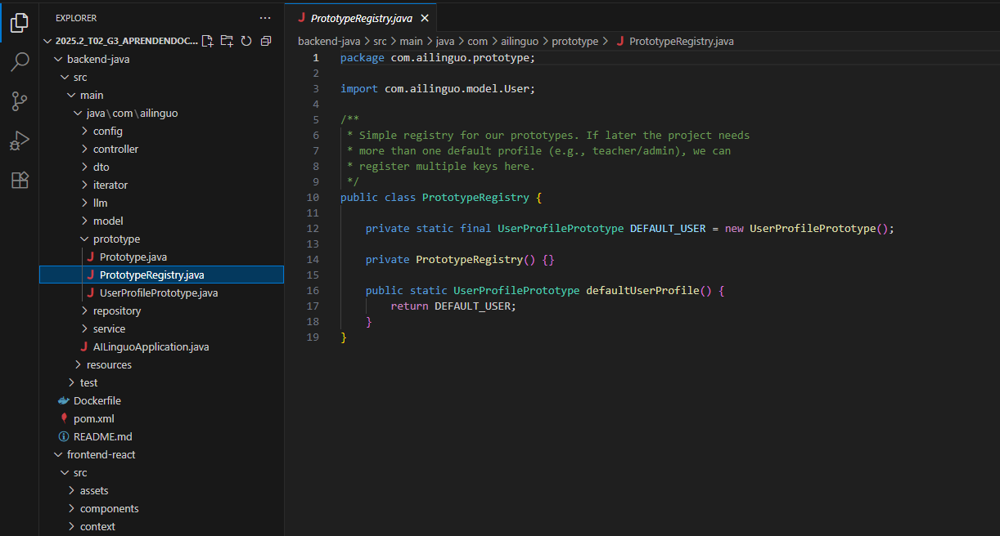
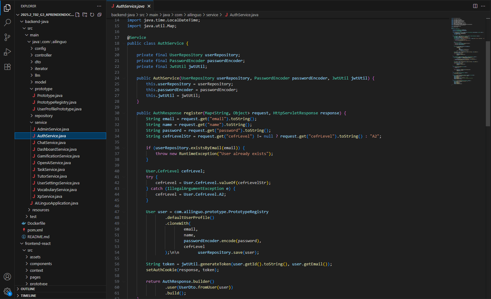
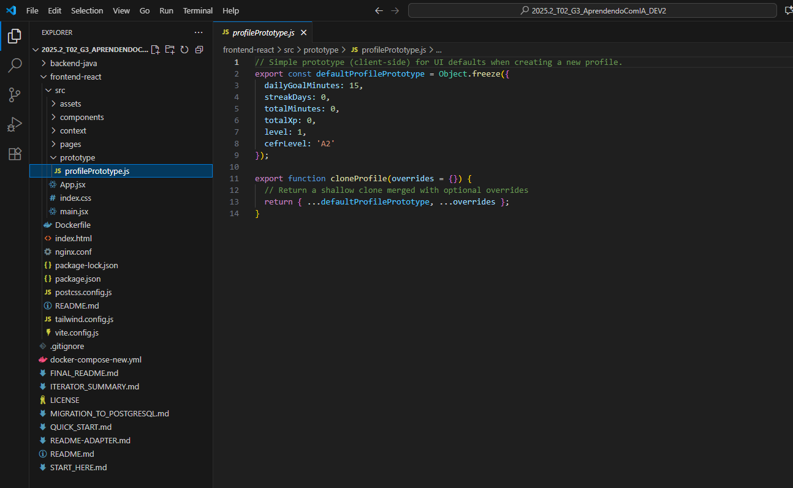
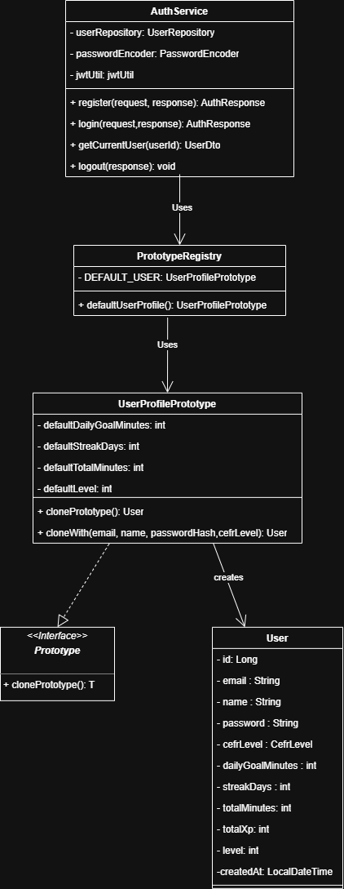

# Prototype

---
## Sumário
- [Introdução](#introdução)
- [Metodologia](#Metodologia)
- [Diagrama UML](#diagrama)
- [Discussão Vantagens e Desvantagens do Prototype](#Discussão-Vantagens-e-Desvantagens-do-Prototype)
- [Conclusão](#Conclusão)
- [Referências Bibliográficas](#referencias-bibliográficas)
- [Histórico de Versões](#histórico-de-versões)

---

## Introdução

Segundo Eric Freeman, no livro __"Use a Cabeça! Padrões E Projetos"__, o padrão __Prototype__ é especificar os tipos de objetos a serem criados usando uma instância-protótipo e criar novos objetos pela cópia desse protótipo. Nesse sentido, o padrão __Prototype__ utiliza uma instância de um objeto, conhecida como protótipo, como base para criar novos objetos, ou seja, em vez de criar objetos a partir do zero, novos objetos são criados clonando ou copiando o protótipo.

---

## Metodologia

A implementação do padrão Prototype para a classe VocabularyWord foi realizada em Java com o apoio das ferramentas e extensões para desenvolvimento Java. O processo de desenvolvimento seguiu as práticas padrão de codificação e organização em pacotes. Este pacote adiciona o padrão *Prototype* ao backend para criar um *perfil padrão* que é *clonado* a cada novo cadastro.

As classes do Prototype foram implementadas no pacote com.ailinguo.prototype para representar o sistema de instanciação de serviços da plataforma.

---

##### Imagem do código no VSCODE

As figuras 2, 3, 4 e 5 abaixo ilustram a estrutura das classes do Prototype no ambiente de desenvolvimento VSCode.

    Figura 2: Classe Prototype.java
     
    
     
    <b>Autores:</b> Letícia Monteiro, Arthur Carvalho Leite, Luiz Henrique Soares, Samuel Afonso, Emivalto Da Costa.
     

    Figura 3: Classe UserProfilePrototype.java
     
    
     
    <b>Autores:</b> Letícia Monteiro, Arthur Carvalho Leite, Luiz Henrique Soares, Samuel Afonso, Emivalto Da Costa.
     

    Figura 4: Classe PrototypeRegistry.java
     
    
     
    <b>Autores:</b> Letícia Monteiro, Arthur Carvalho Leite, Luiz Henrique Soares, Samuel Afonso, Emivalto Da Costa.
     

    Figura 5: Classe AuthService.java
     
    
     
    <b>Autores:</b> Letícia Monteiro, Arthur Carvalho Leite, Luiz Henrique Soares, Samuel Afonso, Emivalto Da Costa.
     

    Figura 6: Classe profilePrototype.java
     
    
     
    <b>Autores:</b> Letícia Monteiro, Arthur Carvalho Leite, Luiz Henrique Soares, Samuel Afonso, Emivalto Da Costa.
     

## Diagrama UML

O diagrama UML do padrão Prototype ilustra como o processo de clonagem de objetos é estruturado.

[Luiz Henrique Soares ](https://github.com/luizh-gsoares) 
---

## Discussão Vantagens e Desvantagens do Prototype

A escolha de utilizar o padrão Prototype para as classes de vocabulário foi ponderada, considerando seus benefícios e também as críticas frequentemente associadas a este padrão.

*Vantagens Observadas:*

- *Consistência*: todos os usuários começam com os mesmos valores padrão (minutos/XP/nível…).
- *Flexível*: se vocês criarem um perfil especial (ex.: Admin), basta registrar outro prototype.
- *Baixo acoplamento*: AuthService não conhece valores “mágicos”; ele só clona um protótipo.
- *Teste Rápido*: POST /api/auth/register com { email, name, password, cefrLevel } (campos padrão (goal, streak, xp, level…) são preenchidos via *clone*).

*Desvantagens e Considerações (Críticas ao Prototype):*

É importante reconhecer as críticas comuns ao padrão Prototype, que foram consideradas:

- *Dificuldade na Clonagem de Objetos com Estados Internos Privados*: Se uma classe possui campos privados que precisam ser replicados no clone, a implementação da clonagem pode se tornar mais complicada, pois o método de clonagem pode precisar de acesso a esses membros internos, quebrando o encapsulamento.

- *Gerenciamento de Referências Circulares*: Ao implementar a cópia profunda, um desafio adicional surge quando os objetos têm referências circulares (por exemplo, o objeto A referencia o objeto B, que por sua vez referencia o objeto A). Uma implementação ingênua de cópia profunda pode entrar em um loop infinito ao tentar clonar esses objetos.

## Conclusão

A implementação das classes do Prototype utilizando o padrão Prototype se mostrou eficiente e atendeu ao requisito de otimizar a criação de objetos e aumentar a flexibilidade do sistema. A aplicação do padrão Prototype evidencia a potencial melhoria de desempenho e da complexidade das estruturas de dados envolvidas com sua introdução no processo de instanciação de objetos.

## Referências Bibliográficas

- FREEMAN, Eric et al. __Use A Cabeça Padrões E Projetos.__ Rio de Janeiro: Alta Books, 2007.
- GAMMA, E. et al. __Padrões de projeto : soluções reutilizáveis de software orientado a objetos.__ Porto Alegre: Bookman, 2006.

‌

---

## Histórico de Versões

| Versão | Descrição | Autor(es) | Data de Produção | Revisor(es) | Data de Revisão | Incremento do Revisor |
| :----: | --------- | --------- | :--------------: | ----------- | :-------------: | :-------------------: |
| `1.0` | Documentação e formatação da aba | [Samuel Afonso](https://github.com/SamuelAfonso) | 22/10/2025 | | | |
| `1.1` | Adiciona UML e texto | [Letícia Monteiro](https://github.com/LeticiaMonteiroo) | 23/10/2025 | | | |
