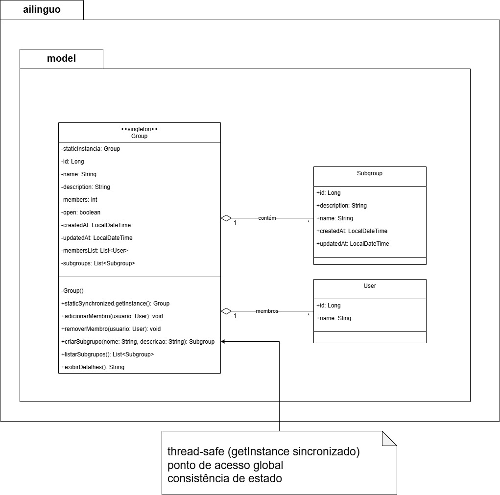

# Singleton (Padrão Criacional) – Implementação Clássica no AILinguo

---
## Sumário
- [Introdução](#introdução)
- [Objetivo](#objetivo)
- [Contexto no AILinguo](#contexto-no-ailinguo)
- [Diagrama UML](#diagrama-uml)
- [Participantes e Mapeamento para o Código](#participantes-e-mapeamento-para-o-código)
- [Desenvolvimento e Implementação](#desenvolvimento-e-implementação)
  - [Implementação nas Classes](#implementação-nas-classes)
  - [Pontos de atenção](#pontos-de-atenção)
- [Código completo](#código-completo)
- [Como usar](#como-usar)
- [Testes](#testes)
- [Vantagens e Desvantagens](#vantagens-e-desvantagens)
- [Conclusão](#conclusão)
- [Referências Bibliográficas](#referências-bibliográficas)
- [Histórico de Versões](#histórico-de-versões)

---

## Introdução

O padrão criacional **Singleton** garante que uma classe tenha **apenas uma instância** durante toda a execução da aplicação e fornece um **ponto global de acesso** a ela. No AILinguo, o padrão Singleton clássico foi implementado manualmente em classes críticas que exigem controle centralizado e instância única: **`Group`** (gerenciamento do grupo principal) e **`JwtUtil`** (utilidades de JWT para autenticação).

---

## Objetivo

- Garantir uma única instância de classes críticas (Group principal e JwtUtil).
- Centralizar o acesso e a lógica compartilhada em um único ponto.
- Economizar recursos evitando múltiplas instâncias desnecessárias.
- Manter consistência de estado entre os consumidores dessas classes.

---

## Contexto no AILinguo

No backend do AILinguo, duas classes foram modeladas explicitamente como Singleton clássico (GoF):

1. **`Group`** (`backend-java/src/main/java/com/ailinguo/model/Group.java`)
   - Representa o **grupo principal** da plataforma.
   - Gerencia membros, criação de subgrupos e operações centralizadas.
   - Singleton para garantir que existe **apenas um grupo principal**.

2. **`JwtUtil`** (`backend-java/src/main/java/com/ailinguo/config/JwtUtil.java`)
   - Responsável por **geração e validação de tokens JWT**.
   - Singleton para centralizar configurações (chave secreta, expiração) e utilidades de segurança.

Ambas seguem a estrutura clássica: construtor privado, atributo estático privado e método público `getInstance()` sincronizado para thread-safety.

---

## Diagrama UML

Figura 1 (Singleton clássico): Modelagem UML de Group e JwtUtil

    
    <b>Autores:</b> Gabriel, Leonardo de Melo, Mateus Bastos, Vitor Bessa, Felipe das Neves.
     

Descrição do diagrama (resumo):

- Classes: `Group` e `JwtUtil`, ambas marcadas com o estereótipo «Singleton».
- Responsabilidade comum: garantir uma única instância acessível de forma global.
- Atributos principais:
  - `Group`: `instancia: Group (static)`, além de `id`, `name`, `description`, `members` e `membersList: List<User>`.
  - `JwtUtil`: `instancia: JwtUtil (static)`, `secret: String` (chave), `expiration: long` (expiração do token).
- Operações principais ligadas ao padrão:
  - `getInstance()` (estático e sincronizado) em ambas as classes, retornando a única instância.
  - Construtor privado para impedir `new` fora da própria classe.
- Operações de domínio/utilidade:
  - `Group`: `adicionarMembro(User)`, `removerMembro(User)`, `criarSubgrupo(...)`, `listarSubgrupos(): List<Group>`, `exibirDetalhes()`.
  - `JwtUtil`: `generateToken(...)`, `extractUserId(...)`, `extractEmail(...)`, `isTokenValid(...)`.
- Observações do projeto:
  - `Group` é uma entidade JPA; o Singleton centraliza o “grupo principal” da plataforma.
  - `JwtUtil` usa `@Component`/`@Value` junto com Singleton manual; recomenda-se padronizar (ou apenas bean Spring, ou apenas Singleton clássico) em uma iteração futura.

---

## Participantes e Mapeamento para o Código

- **Singletons do projeto:**
  - `Group` → `backend-java/src/main/java/com/ailinguo/model/Group.java`
    - Elementos do padrão: `private static Group instancia;` + `private Group()` + `public static synchronized Group getInstance()`
  - `JwtUtil` → `backend-java/src/main/java/com/ailinguo/config/JwtUtil.java`
    - Elementos do padrão: `private static JwtUtil instancia;` + `private JwtUtil()` + `public static synchronized JwtUtil getInstance()`

---

## Desenvolvimento e Implementação

### Implementação nas Classes

Estrutura típica usada em `Group` e `JwtUtil`:

1. Atributo estático privado para guardar a instância única:
~~~java
private static Group instancia;
~~~

2. Construtor privado para impedir `new` fora da classe:
~~~java
private Group() {
    this.id = 1L;
    this.name = "Grupo Principal AILinguo";
    // ...demais inicializações
}
~~~

3. Método público sincronizado para obter a instância (thread-safe):
~~~java
public static synchronized Group getInstance() {
    if (instancia == null) {
        instancia = new Group();
    }
    return instancia;
}

~~~
    
    <b>Autores:</b> Gabriel, Leonardo de Melo, Mateus Bastos, Vitor Bessa, Felipe das Neves.
     

### Pontos de atenção

- O uso de `synchronized` em `getInstance()` garante thread-safety, com possível pequeno custo em cenários de altíssima concorrência.
- Evite estado mutável compartilhado desnecessário nos Singletons; prefira imutabilidade quando possível.
- Em testes, lembre de isolar efeitos (limpar listas/estado se necessário) ou recriar o contexto de teste.

---

## Código completo

<strong>Group.java (Singleton clássico)</strong>

~~~java
// File: backend-java/src/main/java/com/ailinguo/model/Group.java
package com.ailinguo.model;

import jakarta.persistence.*;
import org.springframework.data.annotation.CreatedDate;
import org.springframework.data.annotation.LastModifiedDate;
import org.springframework.data.jpa.domain.support.AuditingEntityListener;

import java.time.LocalDateTime;
import java.util.ArrayList;
import java.util.List;
import java.util.concurrent.atomic.AtomicInteger;

@Entity
@Table(name = "groups") 
@EntityListeners(AuditingEntityListener.class)
public class Group {
    
  // Atributo estático privado para guardar a ÚNICA instância da classe
  private static Group instancia;
    
  @Id
  @GeneratedValue(strategy = GenerationType.IDENTITY)
  private Long id;
    
  @Column(nullable = false)
  private String name;
    
  private String description;
  private Integer members;
  private Boolean open;
    
  // Atributos para gerenciamento centralizado
  private static AtomicInteger proximoGrupoId = new AtomicInteger(1);
  private static List<Group> gruposCriados = new ArrayList<>();
    
  @CreatedDate
  @Column(name = "created_at", nullable = false, updatable = false)
  private LocalDateTime createdAt;
    
  @LastModifiedDate
  @Column(name = "updated_at")
  private LocalDateTime updatedAt;
    
  // Construtor PRIVADO: impede a criação de instâncias com 'new Group()' de fora da classe
  private Group() {
    this.id = 1L;
    this.name = "Grupo Principal AILinguo";
    this.description = "O grupo principal para todos os usuários da plataforma";
    this.members = 0;
    this.open = true;
    this.createdAt = LocalDateTime.now();
    this.updatedAt = LocalDateTime.now();
    this.membersList = new ArrayList<>();
    System.out.println("👥 Instância ÚNICA do Grupo Principal criada! (Singleton) 👥");
  }
    
  // Método estático público para obter a instância única
  public static synchronized Group getInstance() {
    if (instancia == null) {
      instancia = new Group();
    }
    return instancia;
  }
    
  // Relacionamento many-to-many com User
  @ManyToMany(fetch = FetchType.LAZY)
  @JoinTable(
    name = "group_members",
    joinColumns = @JoinColumn(name = "group_id"),
    inverseJoinColumns = @JoinColumn(name = "user_id")
  )
  private List<User> membersList;
    
  // Getters e Setters manuais
  public Long getId() { return id; }
  public void setId(Long id) { this.id = id; }
    
  public String getName() { return name; }
  public void setName(String name) { this.name = name; }
    
  public String getDescription() { return description; }
  public void setDescription(String description) { this.description = description; }
    
  public Integer getMembers() { return members; }
  public void setMembers(Integer members) { this.members = members; }
    
  public Boolean getOpen() { return open; }
  public void setOpen(Boolean open) { this.open = open; }
    
  public LocalDateTime getCreatedAt() { return createdAt; }
  public void setCreatedAt(LocalDateTime createdAt) { this.createdAt = createdAt; }
    
  public LocalDateTime getUpdatedAt() { return updatedAt; }
  public void setUpdatedAt(LocalDateTime updatedAt) { this.updatedAt = updatedAt; }
    
  public List<User> getMembersList() { return membersList; }
  public void setMembersList(List<User> membersList) { this.membersList = membersList; }
    
  // Métodos de negócio para gerenciamento de grupos
  public void adicionarMembro(User usuario) {
    if (usuario != null && !this.membersList.contains(usuario)) {
      this.membersList.add(usuario);
      this.members = this.membersList.size();
      this.updatedAt = LocalDateTime.now();
      System.out.println("[Group Singleton] Usuário '" + usuario.getName() + "' adicionado ao grupo principal. Total de membros: " + this.members);
    }
  }
    
  public void removerMembro(User usuario) {
    if (usuario != null && this.membersList.contains(usuario)) {
      this.membersList.remove(usuario);
      this.members = this.membersList.size();
      this.updatedAt = LocalDateTime.now();
      System.out.println("[Group Singleton] Usuário '" + usuario.getName() + "' removido do grupo principal. Total de membros: " + this.members);
    }
  }
    
  public void criarSubgrupo(String nome, String descricao) {
    int novoId = proximoGrupoId.getAndIncrement();
    Group subgrupo = new Group();
    subgrupo.setId((long) novoId);
    subgrupo.setName(nome);
    subgrupo.setDescription(descricao);
    subgrupo.setMembers(0);
    subgrupo.setOpen(true);
    subgrupo.setCreatedAt(LocalDateTime.now());
    subgrupo.setUpdatedAt(LocalDateTime.now());
    subgrupo.setMembersList(new ArrayList<>());
        
    gruposCriados.add(subgrupo);
    System.out.println("[Group Singleton] Subgrupo '" + nome + "' (ID: " + novoId + ") criado pelo grupo principal.");
  }
    
  public List<Group> listarSubgrupos() {
    System.out.println("[Group Singleton] Listando " + gruposCriados.size() + " subgrupo(s) criado(s)...");
    return new ArrayList<>(gruposCriados);
  }
    
  public void exibirDetalhes() {
    System.out.println("\n--- Detalhes do Grupo Principal (Singleton) ---");
    System.out.println("ID: " + id);
    System.out.println("Nome: " + name);
    System.out.println("Descrição: " + description);
    System.out.println("Membros: " + members);
    System.out.println("Aberto: " + (open ? "Sim" : "Não"));
    System.out.println("Criado em: " + createdAt);
    System.out.println("Atualizado em: " + updatedAt);
    if (membersList.isEmpty()) {
      System.out.println("Lista de Membros: Nenhum membro adicionado ainda.");
    } else {
      System.out.println("Lista de Membros (" + membersList.size() + "):");
      for (User member : membersList) {
        System.out.println("  - " + member.getName() + " (ID: " + member.getId() + ", Email: " + member.getEmail() + ")");
      }
    }
    System.out.println("Subgrupos criados: " + gruposCriados.size());
    System.out.println("HashCode da Instância: " + this.hashCode());
    System.out.println("----------------------------------------");
  }
}
~~~
    
    <b>Autores:</b> Gabriel, Leonardo de Melo, Mateus Bastos, Vitor Bessa, Felipe das Neves.
     

<strong>JwtUtil.java (Singleton clássico)</strong>

~~~java
// File: backend-java/src/main/java/com/ailinguo/config/JwtUtil.java
package com.ailinguo.config;

import io.jsonwebtoken.Claims;
import io.jsonwebtoken.Jwts;
import io.jsonwebtoken.security.Keys;
import org.springframework.beans.factory.annotation.Value;
import org.springframework.stereotype.Component;

import javax.crypto.SecretKey;
import java.nio.charset.StandardCharsets;
import java.util.Date;
import java.util.HashMap;
import java.util.Map;

@Component
public class JwtUtil {
    
  // Atributo estático privado para guardar a ÚNICA instância da classe
  private static JwtUtil instancia;
    
  @Value("${app.jwt.secret}")
  private String secret;
    
  @Value("${app.jwt.expiration}")
  private long expiration;
    
  // Construtor PRIVADO: impede a criação de instâncias com 'new JwtUtil()' de fora da classe
  private JwtUtil() {
    System.out.println("🔐 Instância ÚNICA do JwtUtil criada! (Singleton) 🔐");
  }
    
  // Método estático público para obter a instância única
  public static synchronized JwtUtil getInstance() {
    if (instancia == null) {
      instancia = new JwtUtil();
    }
    return instancia;
  }
    
  private SecretKey getSigningKey() {
    return Keys.hmacShaKeyFor(secret.getBytes(StandardCharsets.UTF_8));
  }
    
  public String generateToken(String userId, String email) {
    Map<String, Object> claims = new HashMap<>();
    claims.put("sub", userId);
    claims.put("email", email);
        
    return Jwts.builder()
        .claims(claims)
        .issuedAt(new Date())
        .expiration(new Date(System.currentTimeMillis() + expiration))
        .signWith(getSigningKey())
        .compact();
  }
    
  public String extractUserId(String token) {
    return extractAllClaims(token).getSubject();
  }
    
  public String extractEmail(String token) {
    return extractAllClaims(token).get("email", String.class);
  }
    
  public boolean isTokenValid(String token) {
    try {
      extractAllClaims(token);
      return !isTokenExpired(token);
    } catch (Exception e) {
      return false;
    }
  }
    
  private Claims extractAllClaims(String token) {
    return Jwts.parser()
        .verifyWith(getSigningKey())
        .build()
        .parseSignedClaims(token)
        .getPayload();
  }
    
  private boolean isTokenExpired(String token) {
    return extractAllClaims(token).getExpiration().before(new Date());
  }
}
~~~

<strong>GroupSingletonTest.java (Testes de Singleton)</strong>

~~~java
// File: backend-java/src/test/java/com/ailinguo/model/GroupSingletonTest.java
package com.ailinguo.model;

import org.junit.jupiter.api.Test;
import org.springframework.boot.test.context.SpringBootTest;

import java.util.List;

import static org.junit.jupiter.api.Assertions.*;

@SpringBootTest
public class GroupSingletonTest {
    

  @Test
  public void testSingletonPattern() {
    System.out.println("\n=== TESTANDO PADRÃO SINGLETON PARA GROUP ===");
        
    // Obter primeira instância
    Group group1 = Group.getInstance();
    System.out.println("Primeira instância obtida. HashCode: " + group1.hashCode());
        
    // Obter segunda instância
    Group group2 = Group.getInstance();
    System.out.println("Segunda instância obtida. HashCode: " + group2.hashCode());
        
    // Obter terceira instância
    Group group3 = Group.getInstance();
    System.out.println("Terceira instância obtida. HashCode: " + group3.hashCode());
        
    // Verificar se todas as instâncias são a mesma
    assertSame(group1, group2, "As duas primeiras instâncias devem ser a mesma");
    assertSame(group2, group3, "As duas últimas instâncias devem ser a mesma");
    assertSame(group1, group3, "A primeira e terceira instâncias devem ser a mesma");
        
    System.out.println("✅ Confirmado: Todas as instâncias são a MESMA! (Singleton funcionando)");
        
    // Testar funcionalidade básica
    assertNotNull(group1.getName(), "Nome do grupo não deve ser nulo");
    assertNotNull(group1.getDescription(), "Descrição do grupo não deve ser nula");
    assertTrue(group1.getOpen(), "Grupo deve estar aberto por padrão");
    assertEquals(0, group1.getMembers(), "Grupo deve começar com 0 membros");
        
    System.out.println("✅ Funcionalidade básica do Group testada com sucesso!");
    System.out.println("Nome do grupo: " + group1.getName());
    System.out.println("Descrição: " + group1.getDescription());
    System.out.println("===============================================\n");
  }
    
  @Test
  public void testGroupManagement() {
    System.out.println("=== TESTANDO GERENCIAMENTO DE GRUPOS ===");
        
    Group grupoPrincipal = Group.getInstance();
        
    // Criar usuários de teste
    User usuario1 = User.builder()
        .id(1L)
        .name("João Silva")
        .email("joao@example.com")
        .password("senha123")
        .cefrLevel(User.CefrLevel.A2)
        .build();
        
    User usuario2 = User.builder()
        .id(2L)
        .name("Maria Santos")
        .email("maria@example.com")
        .password("senha456")
        .cefrLevel(User.CefrLevel.B1)
        .build();
        
    // Testar adição de membros
    grupoPrincipal.adicionarMembro(usuario1);
    assertEquals(1, grupoPrincipal.getMembers(), "Grupo deve ter 1 membro após adicionar usuário1");
        
    grupoPrincipal.adicionarMembro(usuario2);
    assertEquals(2, grupoPrincipal.getMembers(), "Grupo deve ter 2 membros após adicionar usuário2");
        
    // Testar criação de subgrupos
    grupoPrincipal.criarSubgrupo("Grupo Iniciantes", "Grupo para usuários iniciantes");
    grupoPrincipal.criarSubgrupo("Grupo Avançados", "Grupo para usuários avançados");
        
    List<Group> subgrupos = grupoPrincipal.listarSubgrupos();
    assertEquals(2, subgrupos.size(), "Devem existir 2 subgrupos criados");
        
    // Testar remoção de membro
    grupoPrincipal.removerMembro(usuario1);
    assertEquals(1, grupoPrincipal.getMembers(), "Grupo deve ter 1 membro após remover usuário1");
        
    System.out.println("✅ Gerenciamento de grupos testado com sucesso!");
    grupoPrincipal.exibirDetalhes();
    System.out.println("===============================================\n");
  }
    
  @Test
  public void testMultipleThreadsSingleton() {
    System.out.println("=== TESTANDO SINGLETON COM MÚLTIPLAS THREADS ===");
        
    final int NUM_THREADS = 10;
    final Group[] instances = new Group[NUM_THREADS];
    final Thread[] threads = new Thread[NUM_THREADS];
        
    // Criar múltiplas threads que tentam obter a instância
    for (int i = 0; i < NUM_THREADS; i++) {
      final int index = i;
      threads[i] = new Thread(() -> {
        instances[index] = Group.getInstance();
        System.out.println("Thread " + index + " obteve instância. HashCode: " + instances[index].hashCode());
      });
    }
        
    // Iniciar todas as threads
    for (Thread thread : threads) {
      thread.start();
    }
        
    // Aguardar todas as threads terminarem
    for (Thread thread : threads) {
      try {
        thread.join();
      } catch (InterruptedException e) {
        Thread.currentThread().interrupt();
      }
    }
        
    // Verificar se todas as instâncias são a mesma
    Group firstInstance = instances[0];
    for (int i = 1; i < NUM_THREADS; i++) {
      assertSame(firstInstance, instances[i], 
        "Todas as instâncias obtidas em threads diferentes devem ser a mesma");
    }
        
    System.out.println("✅ Singleton thread-safe funcionando corretamente!");
    System.out.println("===============================================\n");
  }
    
  @Test
  public void testGroupOperations() {
    System.out.println("=== TESTANDO OPERAÇÕES DO GRUPO ===");
        
    Group grupo = Group.getInstance();
        
    // Testar criação de múltiplos subgrupos
    grupo.criarSubgrupo("Grupo A1", "Iniciantes absolutos");
    grupo.criarSubgrupo("Grupo A2", "Iniciantes com conhecimento básico");
    grupo.criarSubgrupo("Grupo B1", "Intermediários");
    grupo.criarSubgrupo("Grupo B2", "Intermediários avançados");
    grupo.criarSubgrupo("Grupo C1", "Avançados");
        
    List<Group> subgrupos = grupo.listarSubgrupos();
    assertEquals(5, subgrupos.size(), "Devem existir 5 subgrupos");
        
    // Verificar se os subgrupos têm IDs únicos
    List<Long> ids = subgrupos.stream().map(Group::getId).toList();
    assertEquals(5, ids.stream().distinct().count(), "Todos os IDs devem ser únicos");
        
    // Testar adição de múltiplos usuários
    for (int i = 1; i <= 5; i++) {
      User usuario = User.builder()
          .id((long) i)
          .name("Usuário " + i)
          .email("usuario" + i + "@example.com")
          .password("senha" + i)
          .cefrLevel(User.CefrLevel.A1)
          .build();
      grupo.adicionarMembro(usuario);
    }
        
    assertEquals(5, grupo.getMembers(), "Grupo deve ter 5 membros");
    assertEquals(5, grupo.getMembersList().size(), "Lista de membros deve ter 5 usuários");
        
    System.out.println("✅ Operações do grupo testadas com sucesso!");
    grupo.exibirDetalhes();
    System.out.println("===============================================\n");
  }
}
~~~

<strong>JwtUtilSingletonTest.java (Testes de Singleton para JwtUtil)</strong>

~~~java
// File: backend-java/src/test/java/com/ailinguo/config/JwtUtilSingletonTest.java
package com.ailinguo.config;

import org.junit.jupiter.api.Test;
import static org.junit.jupiter.api.Assertions.*;

public class JwtUtilSingletonTest {

  @Test
  public void testSingletonPattern() {
    JwtUtil u1 = JwtUtil.getInstance();
    JwtUtil u2 = JwtUtil.getInstance();
    assertSame(u1, u2, "As instâncias de JwtUtil devem ser a mesma (Singleton)");
  }

  @Test
  public void testMultipleThreadsSingleton() throws InterruptedException {
    final int NUM_THREADS = 10;
    final JwtUtil[] instances = new JwtUtil[NUM_THREADS];
    final Thread[] threads = new Thread[NUM_THREADS];

    for (int i = 0; i < NUM_THREADS; i++) {
      final int idx = i;
      threads[i] = new Thread(() -> instances[idx] = JwtUtil.getInstance());
    }
    for (Thread t : threads) t.start();
    for (Thread t : threads) t.join();

    JwtUtil first = instances[0];
    for (int i = 1; i < NUM_THREADS; i++) {
      assertSame(first, instances[i], "Todas as threads devem obter a mesma instância de JwtUtil");
    }
  }
}
~~~

Observação: Este teste foca apenas na propriedade de Singleton de `JwtUtil`. Como a classe usa `@Value` para ler propriedades e possui `@Component`, métodos que dependem de `secret`/`expiration` (como `generateToken`) não devem ser exercitados aqui a menos que você ajuste a injeção/configuração para o cenário de teste.

---

## Como usar

Não instancie com `new`. Sempre acesse pelo método estático `getInstance()`:

~~~java
// Group (Singleton)
Group grupoPrincipal = Group.getInstance();
grupoPrincipal.adicionarMembro(usuario);

// JwtUtil (Singleton)
JwtUtil jwt = JwtUtil.getInstance();
String token = jwt.generateToken("123", "user@example.com");
~~~

---

## Testes

Os testes de verificação do Singleton estão em:

- `backend-java/src/test/java/com/ailinguo/model/GroupSingletonTest.java`
- (Opcional sugerido) `backend-java/src/test/java/com/ailinguo/config/JwtUtilSingletonTest.java`

Principais verificações implementadas:

1. Múltiplas chamadas a `Group.getInstance()` retornam a **mesma instância** (`assertSame`).
2. Operações de negócio preservam estado na instância única (adicionar/remover membros, criar/listar subgrupos).
3. **Thread-safety**: 10 threads chamando `getInstance()` retornam a mesma referência (mesmo hashCode).

---

## Vantagens e Desvantagens

### Vantagens
- Controle rigoroso da instância única.
- Economia de recursos ao evitar múltiplas instâncias.
- Ponto de acesso global centralizado.
- Consistência de estado visível a todos os consumidores.

### Desvantagens
- Pode aumentar acoplamento global se usado indiscriminadamente.
- Pode dificultar testes (estado compartilhado entre cenários).
- `synchronized` pode impactar performance em picos de concorrência.

---

## Conclusão

O AILinguo utiliza o **Singleton clássico** nas classes **`Group`** e **`JwtUtil`** para garantir instância única e acesso centralizado a funcionalidades críticas (gestão do grupo principal e utilidades de JWT). A implementação segue o padrão do GoF e foi validada por testes que cobrem unicidade, operações de negócio e cenários com múltiplas threads.

---

## Bibliogaria

> FREEMAN, Eric et al. Use A Cabeça Padrões e Projetos. Rio de Janeiro: Alta Books, 2007.

> GAMMA, E. et al. Padrões de projeto: soluções reutilizáveis de software orientado a objetos. Porto Alegre: Bookman, 2006.

> Refactoring.Guru – Singleton: https://refactoring.guru/pt-br/design-patterns/singleton

---

## Histórico de versão

| Versão | Descrição | Autor(es) | Data de Produção | Revisor(es) | Data de Revisão | Incremento do Revisor |
| :----: | --------- | --------- | :--------------: | ----------- | :-------------: | :-------------------: |
| `1.0` | Elaboração dos códigos | [Leonardo de Melo, Vitor Bessa, Felipe das Neves]() | 22/10/2025 | | | |
| `1.1` | Eaboração da documentação | [Gabriel Lima, Mateus Bastos, Leonardo de Melo, Vitor Bessa, Felipe das Neves]() | 22/10/2025 | | | |
| `1.2` | Ajuste imagens dos códigos e UML | [ Mateus Bastos](https://github.com/SamuelAfonso) | 22/10/2025 | | | |
